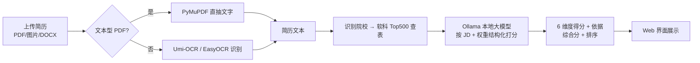

# 📄 本地简历 OCR + AI 岗位打分

> **100% 本机运行**的简历评估工具：**OCR 识别简历内容 → 本地 Ollama 大模型按岗位需求结构化打分**。
> 数据全程不出本机，无需联网、无需任何 API Key。

***

## ✨ 功能特性

- ✅ **批量上传解析**：一次上传多份简历（PDF / 图片 / DOCX），逐份 OCR 识别与打分。
- ✅ **多格式简历输入**：PDF（文本型直接抽取、扫描型自动 OCR）、PNG/JPG 等图片、DOCX。
- ✅ **混合 OCR 策略**：文本型 PDF 用 PyMuPDF 直抽文字（快且准），仅扫描件/图片才走 OCR。
- ✅ **默认调用本机 Umi-OCR**：直接复用你已安装的 Umi-OCR（底层 `PaddleOCR-json`，中文精度高、已装即用）；找不到时自动回退到 EasyOCR。
- ✅ **AI 结构化评分 + 打分依据**：调用本地 Ollama 模型，输出
  - 综合匹配度（0–100，按权重计算）
  - 6 个维度得分：**专业技能 / 工作经验 / 教育背景 / 项目与成果 / 综合素质 / 当前居住地**，每个维度都附带 `打分依据`（引用简历与 JD 的具体证据）
  - 整体打分依据、优势点、差距/风险点、是否建议面试、一句话总结
- ✅ **教育背景参考大学排名**：评估「教育背景」时自动参考
  - **软科 2025 中国大学排名主榜 Top500**（完整榜单内置为离线查表 `app/rank_data.py`，评分时从简历识别院校并注入其精确名次/段位）
  - 院校分层规则：985 > 211 > 双一流 > 普通本科 > 专科；海外院校参考 QS/泰晤士等国际排名
  - 打分依据的 `basis` 中会说明院校层次/排名对分数的影响
- ✅ **认可院校名单（自定义强匹配）**：左侧可填写「认可院校名单」，名单内院校在「教育背景」维度视为强匹配、优先加分；不填则按通用排名分层评估。
- ✅ **维度权重可自由调整**：每个维度的百分比均可在界面修改；综合分 = Σ(维度分×权重) ÷ Σ权重。修改权重后结果**实时重算并按综合分降序重新排序**，无需再次调用 AI。
- ✅ **结果自动排序**：批量打分完成后，结果按综合分从高到低排列，方便快速筛选。
- ✅ **Web 界面**：批量上传、填写 JD、调权重、选模型、一键出结果（直角矩形 UI）。

***

## 🖼️ 效果截图

> [界面截图](docs/screenshot.png)
> [界面截图](docs/screenshot1.png)

***

## 🧩 工作原理



***

## 📋 目录

- [📄 本地简历 OCR + AI 岗位打分](#-本地简历-ocr--ai-岗位打分)
  - [✨ 功能特性](#-功能特性)
  - [🖼️ 效果截图](#️-效果截图)
  - [🧩 工作原理](#-工作原理)
  - [📋 目录](#-目录)
  - [🔧 环境要求](#-环境要求)
  - [🚀 快速开始](#-快速开始)
  - [⚙️ OCR 引擎配置](#️-ocr-引擎配置)
  - [📖 使用步骤](#-使用步骤)
  - [🔌 API 说明](#-api-说明)
  - [🏫 院校排名数据](#-院校排名数据)
  - [📁 目录结构](#-目录结构)
  - [❓ 常见问题](#-常见问题)
  - [👌 欢迎提 Issue 与 PR！](#-欢迎提-issue-与-pr)
  - [📄 许可证](#-许可证)

***

## 🔧 环境要求

| 项目     | 说明                                                                                                           |
| ------ | ------------------------------------------------------------------------------------------------------------ |
| 操作系统   | Windows                                                                                                      |
| Python | 3.10+（本项目用 3.13 验证）                                                                                          |
| Ollama | 已安装并运行，且至少有一个模型（推荐 `qwen3.5:4b` 或 `qwen3.5:9b` 等中文模型）                                                        |
| OCR 引擎 | **二选一即可**：① 本机已装 [Umi-OCR](https://github.com/hiroi-sora/Umi-OCR)（Paddle 版，推荐）；② 不装 Umi-OCR，改由本项目 EasyOCR 兜底 |

***

## 🚀 快速开始

```bash
# 1. 克隆仓库

# 2. 安装ocr软件
作者使用版本Umi-OCR_Paddle_v2.1.5.7z.exe
仓库链接:https://github.com/hiroi-sora/Umi-OCR

# 3. 安装依赖（使用本机 Umi-OCR 时只需核心依赖）
pip install -r requirements.txt
# 若没有 Umi-OCR、需要 EasyOCR 兜底，参见下方“OCR 引擎配置”

# 4. 准备ollama本地模型(ollama已安装并运行)
ollama pull qwen3.5:4b        # 任选一个中文模型

# 5. 启动服务
python -m uvicorn app.main:app --host 0.0.0.0 --port 8000
# 或直接双击 start.bat（Windows）/ 运行 start.sh
```

浏览器打开 <http://localhost:8000> 即可使用。

> 💡 Windows 下打开 Ollama 桌面应用即会自动启动 Ollama 服务；其他系统可运行 `ollama serve`。首次打分若模型未加载会稍慢（自动加载）。

***

## ⚙️ OCR 引擎配置

应用默认调用本机 Umi-OCR 的 `PaddleOCR-json.exe`。可通过环境变量指定其路径：

```bash
# 默认路径（本项目已按本机 Umi-OCR 安装位置预设）：
#   D:\software\OCR\Umi-OCR_Paddle_v2.1.5\UmiOCR-data\plugins\win7_x64_PaddleOCR-json\PaddleOCR-json.exe
# 若你的安装位置不同，设置环境变量覆盖即可（Windows）：
set UMI_OCR_EXE=D:\你的路径\UmiOCR-data\plugins\win7_x64_PaddleOCR-json\PaddleOCR-json.exe
# 启动前设置引擎初始化超时（秒，默认 90，冷启动较慢时可调大）：
set UMI_OCR_INIT_TIMEOUT=120
```

> 注意：`PaddleOCR-json.exe` 必须以**自身所在目录**为工作目录运行（才能找到 `models/`），应用已自动处理。
> 应用启动后访问 `GET /api/engine` 可查看当前实际使用的 OCR 后端（Umi-OCR 或 EasyOCR 兜底）。

**没有 Umi-OCR？用 EasyOCR 兜底：**

```bash
# 先装 CPU 版 torch（务必加这个 index，避免拉取庞大的 CUDA 版）
pip install torch torchvision --index-url https://download.pytorch.org/whl/cpu
# 再装 EasyOCR
pip install easyocr
```

***

## 📖 使用步骤

1. 在左侧批量上传简历文件（PDF / 图片 / DOCX，可多选）。
2. 按需调整「维度权重」（百分比，默认合计 100，可自行修改；综合分按权重计算）。
3. 填写岗位需求（JD）。
4. （可选）在「认可院校名单」中填写贵司/本岗优先的院校（每行一个校名），名单内院校在「教育背景」维度会被视为强匹配。
5. 选择评分模型（下拉框会自动列出本机 Ollama 模型）。
6. 点击「开始评分」，右侧按综合分从高到低展示每份简历的整体分、各维度条形图（含打分依据）、优势/差距与面试建议。
7. 评分完成后仍可随时拖动/修改权重，结果会**实时重算并重排序**，无需重新调用 AI。

***

## 🔌 API 说明

| 方法   | 路径             | 说明                                                                                                                 |
| ---- | -------------- | ------------------------------------------------------------------------------------------------------------------ |
| GET  | `/api/models`  | 返回本机 Ollama 模型列表与默认模型                                                                                              |
| GET  | `/api/weights` | 返回默认维度顺序与默认权重，供前端初始化权重编辑器                                                                                          |
| POST | `/api/score`   | `resumes`(多文件) + `jd`(文本) + `model`(模型名) + `weights`(权重 JSON) + `preferred_schools`(认可院校名单文本，可选) → 批量结构化评分（按综合分降序） |
| GET  | `/api/engine`  | 返回当前实际使用的 OCR 后端（Umi-OCR 或 EasyOCR 兜底）                                                                             |
| GET  | `/`            | 前端首页                                                                                                               |

`/api/score` 返回示例：

```json
{
  "count": 2,
  "weights": {"专业技能":25,"工作经验":25,"教育背景":10,"项目与成果":25,"综合素质":10,"当前居住地":5},
  "results": [
    {
      "filename": "sample_resume_A.pdf",
      "overall_score": 86,
      "dimensions": [
        {"name": "专业技能", "score": 90, "comment": "...", "basis": "简历明确列出 Java/Spring Boot/MySQL/Redis，与 JD 高度吻合"},
        {"name": "工作经验", "score": 85, "comment": "...", "basis": "..."},
        {"name": "教育背景", "score": 75, "comment": "...", "basis": "..."},
        {"name": "项目与成果", "score": 88, "comment": "...", "basis": "..."},
        {"name": "综合素质", "score": 80, "comment": "...", "basis": "..."},
        {"name": "当前居住地", "score": 95, "comment": "...", "basis": "现居杭州，与 JD 工作地一致"}
      ],
      "strengths": ["...", "..."],
      "gaps": ["..."],
      "recommend_interview": true,
      "summary": "...",
      "basis": "整体匹配度高，核心维度均达标……"
    }
  ],
  "errors": []
}
```

***

## 🏫 院校排名数据

「教育背景」维度的院校排名参考采用**离线查表**方案：

- 完整榜单数据位于 [`app/rank_data.py`](app/rank_data.py)，内置**软科 2025 中国大学排名主榜（BCUR）Top500**（来源：[软科官网](https://www.shanghairanking.cn/rankings/bcur/2025)，含并列名次），以 `(名次, 校名)` 列表与 `{校名: 名次}` 字典两种形式提供。
- 评分时由 [`app/prompts.py`](app/prompts.py) 的 `detect_schools()` 自动从简历文本识别校名，再用 `format_school_ref()` 注入其精确名次/段位，而非把整张榜单塞进 prompt，兼顾精度与上下文长度。
- 分层规则（`SCHOOL_TIER_HINT`）：985 > 211 > 双一流 > 普通本科 > 专科；海外院校参考 QS/泰晤士等国际排名。

如需接入实时排名，可替换 `app/rank_data.py` 的数据源。

***

## 📁 目录结构

```
.
├── app/
│   ├── main.py          # FastAPI 应用与接口
│   ├── ocr.py           # 文本提取（混合 OCR 策略：Umi-OCR 优先，EasyOCR 兜底）
│   ├── scorer.py        # 调用 Ollama 结构化打分
│   ├── prompts.py       # 提示词模板与院校识别/查表逻辑
│   ├── schemas.py       # 数据模型与 JSON Schema
│   ├── rank_data.py     # 软科 2025 主榜 Top500 离线查表数据
│   └── static/
│       └── index.html   # 前端单页
├── requirements.txt     # 依赖（核心 + 可选 EasyOCR 兜底说明）
├── start.bat / start.sh # 一键启动脚本
├── .gitignore
├── LICENSE
└── README.md
```

***

## ❓ 常见问题

- **OCR 引擎用的是哪个？** 默认调用本机已安装的 Umi-OCR（PaddleOCR-json 引擎），界面无感知；若 `GET /api/engine` 显示 `easyocr`，说明没找到 Umi-OCR，已自动回退。
- **首次 OCR 很慢？** Umi-OCR 的 Paddle 模型冷启动需几秒到十几秒（仅首次），之后常驻进程复用；EasyOCR 兜底首次还需下载模型。
- **模型列表为空？** 确认 Ollama 已启动且 `ollama list` 有模型；应用通过 `localhost:11434` 访问。
- **扫描件识别不准？** 提高扫描清晰度，或在 `app/ocr.py` 中调大 `pix.get_pixmap(dpi=200)` 的 DPI。
- **想换评分维度/权重？** 修改 `app/prompts.py` 与 `app/schemas.py` 中的维度定义即可。
- **想调整院校排名参考？** 编辑 `app/rank_data.py` 的数据源；识别/注入逻辑见 `app/prompts.py` 的 `detect_schools` / `format_school_ref`。
- **找不到 Umi-OCR / 想换路径？** 设置环境变量 `UMI_OCR_EXE` 指向你的 `PaddleOCR-json.exe`。

***

## 👌 欢迎提 Issue 与 PR！

***

## 📄 许可证

本项目采用 [MIT 许可证](LICENSE)。
